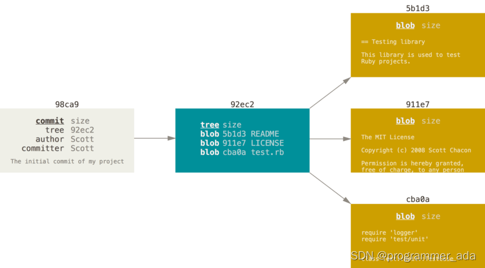
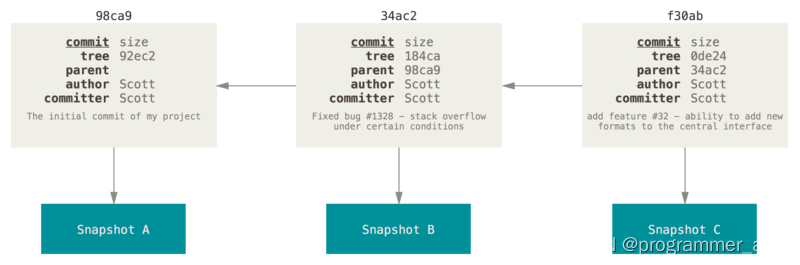
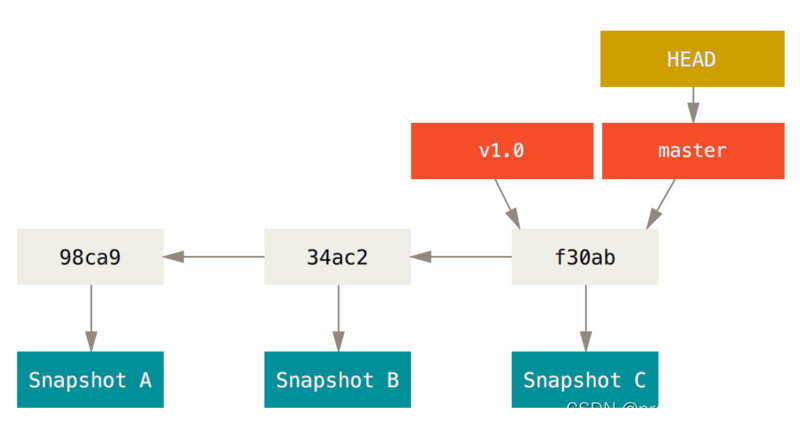
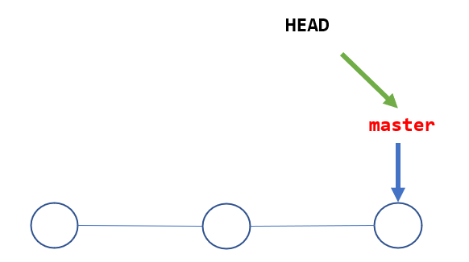
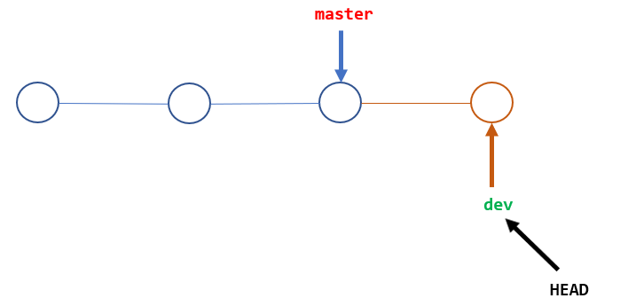
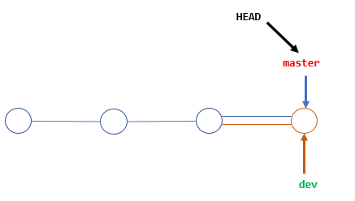
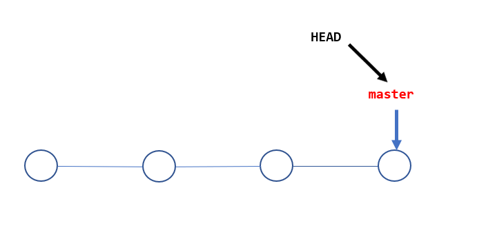

<font face="楷体" size=3>

# GIT 分支管理

## git分支简介

在进行提交操作时，Git 会保存一个提交对象（commit object）。 知道了 Git 保存数据的方式，我们可以很自然的想到——该提交对象会包含一个指向暂存内容快照的指针。 
但不仅仅是这样，该提交对象还包含了作者的姓名和邮箱、提交时输入的信息以及指向它的父对象的指针。 
首次提交产生的提交对象没有父对象，普通提交操作产生的提交对象有一个父对象， 而由多个分支合并产生的提交对象有多个父对象，为了更加形象地说明，我们假设现在有一个工作目录，里面包含了三个将要被暂存和提交的文件。 暂存操作会为每一个文件计算校验和，然后会把当前版本的文件快照保存到 Git 仓库中
（Git 使用 blob 对象来保存它们），最终将校验和加入到暂存区域等待提交：

```
$ git add readme.txt test.md LICENSE
$ git commit -m 'The initial commit of my project'
```

当使用 git commit 进行提交操作时，Git 会先计算每一个子目录（本例中只有项目根目录）的校验和， 然后在 Git 仓库中这些校验和保存为树对象。随后，Git 便会创建一个提交对象， 它除了包含上面提到的那些信息外，还包含指向这个树对象（项目根目录）的指针。 如此一来，Git 就可以在需要的时候重现此次保存的快照。

现在，Git 仓库中有五个对象：三个 blob 对象（保存着文件快照）、一个 树 对象 （记录着目录结构和 blob 对象索引）以及一个 提交 对象（包含着指向前述树对象的指针和所有提交信息）。




首次提交对象及其树结构

做些修改后再次提交，那么这次产生的提交对象会包含一个指向上次提交对象（父对象）的指针。



提交对象及其父对象

Git 的分支，其实本质上仅仅是指向提交对象的可变指针。 Git 的默认分支名字是 master。 在多次提交操作之后，你其实已经有一个指向最后那个提交对象的 master 分支。 master 分支会在每次提交时自动向前移动。



分支及其提交历史

## 创建分支
Git 会把仓库中的每次提交串成一条时间线，这条时间线就是一个分支。在 Git 里，每个仓库都会有一个主分支，即master分支。HEAD严格来说不是指向提交，而是指向master，master才是指向提交的，所以，HEAD指向的就是当前分支。

一开始的时候，master分支是一条线，Git 用master指向最新的提交，再用HEAD指向master，就能确定当前分支，以及当前分支的提交点：



每次提交，master分支都会向前移动一步，这样，随着你不断提交，master分支的线也越来越长。

当我们创建新的分支，例如dev时，Git 新建了一个指针叫dev，指向master相同的提交，再把HEAD指向dev，就表示当前分支在dev上：



你看，Git 创建一个分支很快，因为除了增加一个dev指针，改改HEAD的指向，工作区的文件都没有任何变化！

不过，从现在开始，对工作区的修改和提交就是针对dev分支了，比如新提交一次后，dev指针往前移动一步，而master指针不变：

假如我们在dev上的工作完成了，就可以把dev合并到master上。Git 怎么合并呢？最简单的方法，就是直接把master指向dev的当前提交，就完成了合并：

所以 Git 合并分支也很快！就改改指针，工作区内容也不变！

合并完分支后，甚至可以删除dev分支。删除dev分支就是把dev指针给删掉，删掉后，我们就剩下了一条master分支：



## 步骤

首先，我们创建dev分支，然后切换到dev分支：

```
$ git checkout -b dev
Switched to a new branch 'dev'
```

git checkout命令加上-b参数表示创建并切换，相当于以下两条命令：

```
$ git branch dev
$ git checkout dev
Switched to branch 'dev'
```

然后，用git branch命令查看当前分支：

```
$ git branch
* dev
  master
```

git branch命令会列出所有分支，当前分支前面会标一个*号。
然后，我们就可以在dev分支上正常提交，比如对README.md做个修改，加上一行

```
Creating a new branch is quick.
```

然后提交：

```
$ git add README.md
$ git commit -m "branch test"
[dev 4aac6c7] branch test
 1 file changed, 1 insertion(+)
```

现在，dev分支的工作完成，我们就可以切换回master分支：

```
$ git checkout master
Switched to branch 'master'
```

切换回master分支后，再查看一个README.md文件，刚才添加的内容不见了！因为那个提交是在dev分支上，而master分支此刻的提交点并没有变：



现在，我们把dev分支的工作成果合并到master分支上：

```
$ git merge dev
Updating 599dbdb..4aac6c7
Fast-forward
 readme.txt | 1 +
 1 file changed, 1 insertion(+)
```

git merge命令用于合并指定分支到当前分支。合并后，再查看readme.txt的内容，就可以看到，和dev分支的最新提交是完全一样的。

注意到上面的Fast-forward信息，Git 告诉我们，这次合并是“快进模式”，也就是直接把master指向dev的当前提交，所以合并速度非常快。

当然，也不是每次合并都能Fast-forward，我们后面会讲其他方式的合并。

合并完成后，就可以放心地删除dev分支了：

```
$ git branch -d dev
Deleted branch dev (was 4aac6c7).
```

删除后，查看branch，就只剩下master分支了：

```
$ git branch
* master
```

因为创建、合并和删除分支非常快，所以 Git 鼓励你使用分支完成某个任务，合并后再删掉分支，这和直接在master分支上工作效果是一样的，但过程更安全。

